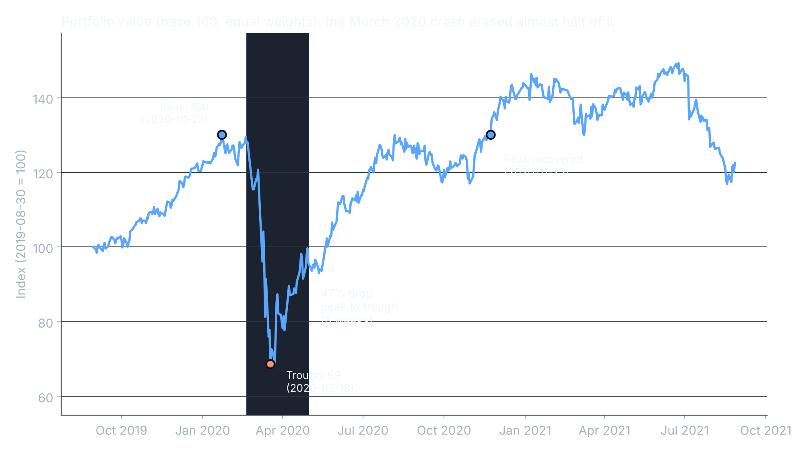
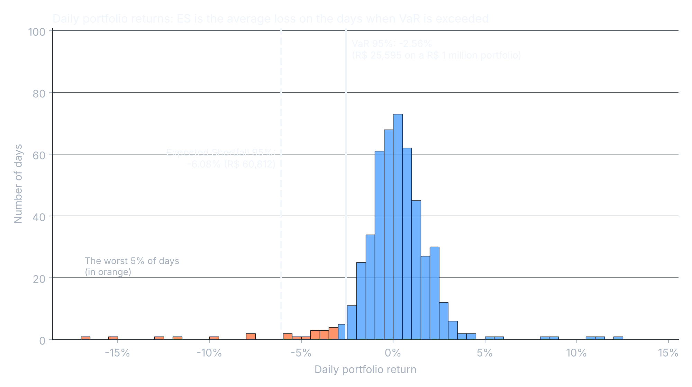
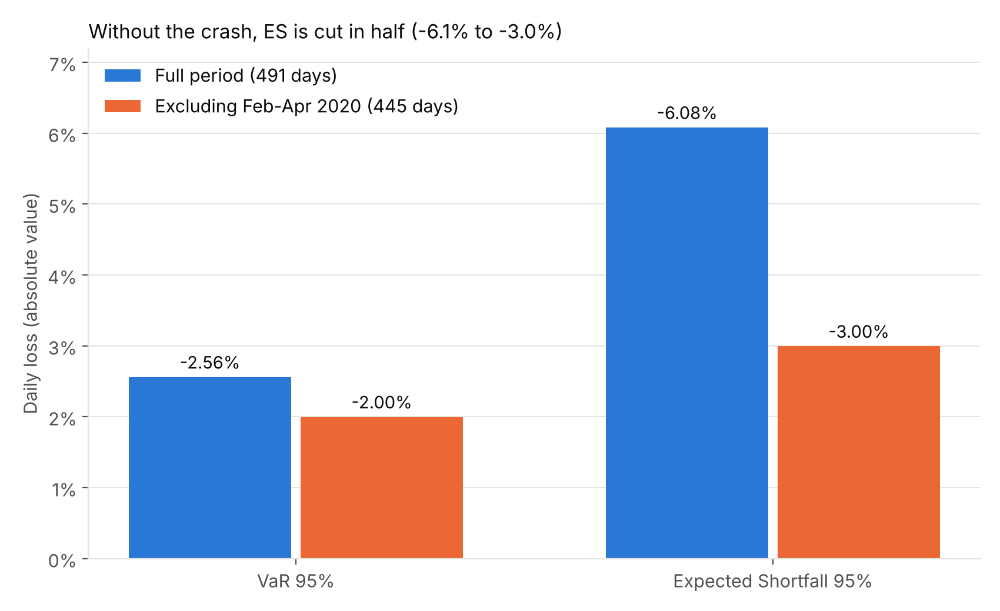
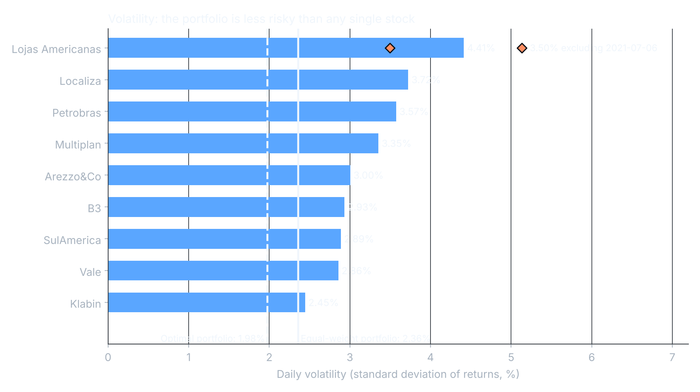
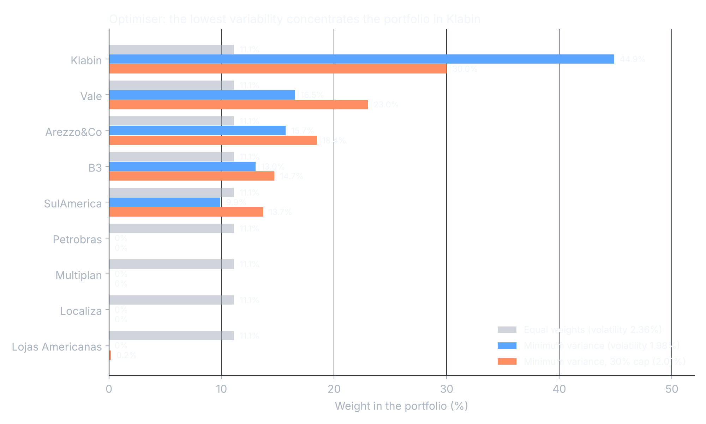
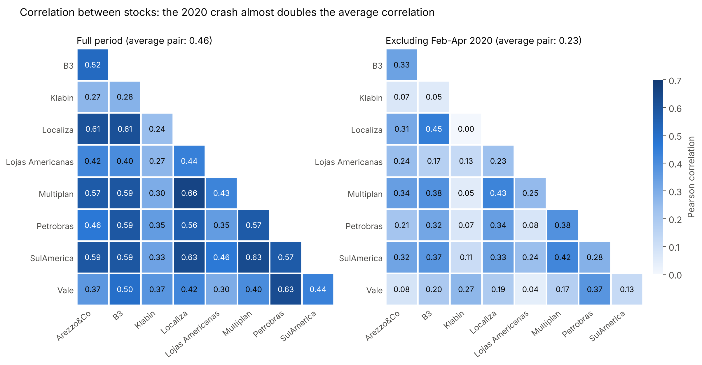
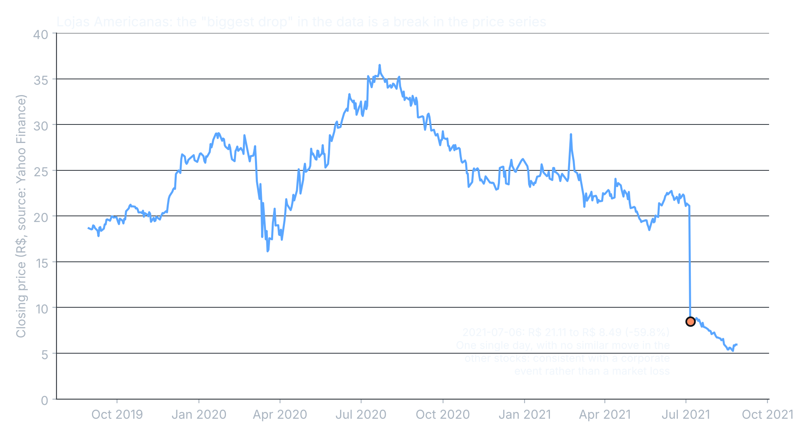

# Value at Risk (VaR) Analysis of a 9-Stock Portfolio

Historical VaR, Expected Shortfall, correlation structure and minimum-variance allocation for an equal-weight portfolio of nine Brazilian stocks (Sep 2019 – Aug 2021), with a backtest and a transparent, formula-driven Excel model.
> **Main finding:** the March 2020 crash dominates everything. About 9% of the days (the Feb–Apr 2020 window) hold 56% of the worst 5% days. Without it, Expected Shortfall 95% falls by about 51%, and the average pairwise correlation drops from 0.72 to 0.23.
> ---

## Key results

| Metric | Value |
|---|---|
| Daily volatility (equal-weight portfolio) | 2.36% |
| Historical VaR 95% (1 day) | -2.56% (R$ 25,595 on R$ 1,000,000) |
| Expected Shortfall 95% | -6.08% (R$ 60,812) |
| VaR / ES 95% excluding the crash window | -2.00% / -3.00% |
| Share of the worst 5% days inside the crash | 56% (14 of 25 days) |
| Maximum drawdown | -47.2% (peak 2020-01-23, trough 2020-03-18, recovered 2020-11-23) |
| Average pairwise correlation: full / ex-crash / crash only | 0.46 / 0.23 / 0.72 |
| Daily volatility, minimum-variance portfolio | 1.98% (-16% vs. equal weights) |
| Same, with a 30% cap per stock | 2.01% |
| Out-of-sample volatility vs. equal weights | about -10% |
| Backtest: violations of the VaR 95% | 3 in 245 days (1.2% vs. 5% expected), Kupiec p = 0.0012 |

## Business question

*How much can a R$ 1 million portfolio of nine stocks lose in a single day, how bad can it get beyond that threshold, and can the same stocks be combined in a way that reduces risk?*

## Data

- Nine Brazilian stocks: Arezzo, B3, Klabin, Localiza, Lojas Americanas, Multiplan, Petrobras, SulAmérica and Vale.
- 492 daily closing prices (2019-09-01 to 2021-08-27), 491 daily returns.
- Source: course exercise workbook. Prices are in `data/stock_prices.csv` and `data/stock_prices.xlsx`.
- Base portfolio: equal weights (1/9 each), R$ 1,000,000.

## Methodology

1. **Returns:** simple daily returns per stock; the portfolio return is the weighted sum.
2. **Historical VaR 95%:** the 5th percentile of the portfolio's daily returns. No distribution is assumed.
3. **Expected Shortfall 95%:** the average return of the days at or below the VaR (the 25 worst days).
4. **Crash effect:** the same metrics recomputed excluding 2020-02-20 to 2020-04-30.
5. **Correlation:** three matrices (full period, ex-crash, crash only).
6. **Optimization:** long-only minimum-variance weights (Markowitz), with and without a 30% cap per stock, solved with SLSQP in Python and replicated with Excel Solver.
7. **Out-of-sample check:** weights fitted up to 2020-08-26 and tested on the following period.
8. **Backtest:** VaR estimated on the first 245 days and tested on the next 245 days with Kupiec's proportion-of-failures test.

## Findings

### 1. The crash drives the picture



The equal-weight portfolio lost 47% from peak to trough in under two months and needed until November 2020 to recover.

### 2. VaR tells you where the tail starts, ES tells you how deep it is



The distribution has fat tails, so a normal-distribution assumption would understate the risk. ES (-6.08%) is more than twice the VaR (-2.56%).

### 3. Without the crash, the tail is half as deep



### 4. Diversification works, but not equally for every stock



The equal-weight portfolio (2.36%) is 27% less volatile than the average of its nine stocks (3.24%).

### 5. The minimum-variance portfolio



The optimizer concentrates on Klabin (45%), Arezzo, SulAmérica, Vale and B3, and gives zero weight to four stocks. The result (1.98%) is below the volatility of any single stock, including the calmest one (Klabin, 2.45%). With a 30% cap the gain is almost the same (2.01%) and the portfolio is much less concentrated.

### 6. Correlations rise when it matters



Diversification is weakest in a crash: the average pairwise correlation is 0.23 in normal times and 0.72 in the crash window.

### 7. A data-quality note: Lojas Americanas



Lojas Americanas shows a -59.8% "return" on 2021-07-06 (R$ 21.11 to R$ 8.49). This looks like a **break in the price series** (probably a corporate reorganization), not a market loss. *The cause is inferred from public headlines and still needs to be confirmed against the official corporate-event record.* Excluding that day, the stock's volatility is 3.50%, and the portfolio's VaR / ES change to -2.51% / -5.87%. The 2023 accounting fraud at the company is **outside** the data period.

## Repository structure

```
VaR-Portfolio-Analysis/
├── README.md
├── data/
│   ├── stock_prices.csv
│   └── stock_prices.xlsx
├── spreadsheets/
│   └── var_portfolio_analysis.xlsx
├── images/
│   └── 01 to 07 (PNG charts)
└── code/
    ├── generate_charts.py
    └── build_workbook.py
```

### The workbook

`spreadsheets/var_portfolio_analysis.xlsx` is fully formula-driven (about 20,000 live formulas, no hard-coded results). Blue cells are inputs.

- **Summary:** headline numbers.
- **Inputs:** portfolio value, tail probability, crash window, training end date, backtest window, weight cap.
- **Prices / Returns / Returns_Helper:** data and calculations.
- **Risk_Metrics:** VaR, ES, crash effect, drawdown, per-stock volatility, sensitivity.
- **Correlation:** the three correlation matrices.
- **Optimization:** weights, covariance matrix, Solver steps, out-of-sample block.
- **Backtest:** violations and Kupiec test.

## How to reproduce

```bash
pip install pandas numpy scipy matplotlib openpyxl

# Charts (reads data/stock_prices.csv, writes images/)
python code/generate_charts.py

# Workbook (writes spreadsheets/var_portfolio_analysis.xlsx)
python code/build_workbook.py
```

Excel Solver replication of the optimal weights (Optimization sheet):

1. Open Solver (Data tab) and set the objective to the portfolio variance cell, minimizing it.
2. Variable cells: the weights row of the minimum-variance portfolio.
3. Constraints: weights sum to 1, weights >= 0 (and <= 30% for the capped version).
4. Method: GRG Nonlinear.

If the workbook is built with the script, open it once in Excel so the cached values are refreshed.

## Limitations and next steps

- **Short sample:** 491 returns, and one extreme event dominates the tail. Results describe this period, not the future.
- **Optimal weights are estimated in-sample.** The out-of-sample test keeps most of the gain (about 10% lower volatility), but the weights are unstable: removing the crash window changes them substantially.
- **The backtest rejects the model** (3 violations vs. 12 expected), because the first period contains the crash and the second one is calm. This is the pro-cyclicality of historical VaR.
- **Next steps:** VaR 99%, parametric (variance-covariance) and Monte Carlo VaR, EWMA/GARCH volatility, and a rolling-window backtest.

## Disclaimer

This is an educational analysis based on a course exercise. It is not investment advice.

## Article

A Portuguese-language article with the full narrative: [https://medium.com/@vitor.grc89/quanto-uma-carteira-de-a%C3%A7%C3%B5es-pode-perder-em-um-dia-ruim-ac81eec4066e?postPublishedType=initial]
